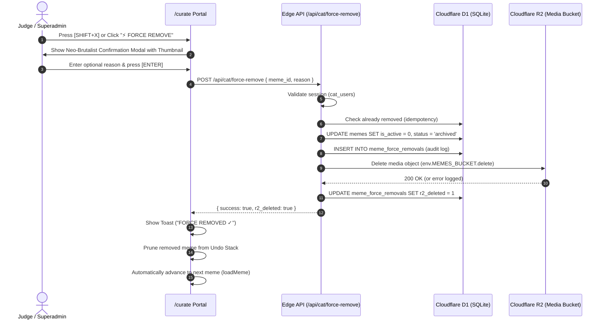

# Context Document: Force Remove Feature & Multi-Judge Curation Integration

> **Document Type:** Architectural & Technical Context Document  
> **Status:** Production / Implemented  
> **Scope:** `/curate` portal, `/categorise` portal, Cloudflare Pages Functions (`/api/cat/force-remove`, `/api/curate/*`), Cloudflare D1, Cloudflare R2  
> **Last Updated:** October 2026  
> **Authors:** Pratham Pandey (`bbethical010-glitch`), Anmol Verma (`editorav010-dev`)

---

## 1. Executive Summary

The **Force Remove** feature empowers authorized judges (`judge1`–`judge5`, `superadmin`) to immediately and irrevocably purge inappropriate, copyright-violating, broken, or corrupt memes directly from the curation workflow. 

Unlike standard curation exclusions (`corpus_status = 'excluded'`), which retain the meme row and R2 media object in the database for consensus review:
1. **Force Remove permanently purges media from Cloudflare R2** (`env.MEMES_BUCKET.delete(storage_path)`).
2. **Deactivates the meme immediately in Cloudflare D1** (`is_active = 0, status = 'archived'`).
3. **Writes an immutable audit log** to `meme_force_removals` containing user attribution, deletion timestamp, reason, and R2 deletion status.
4. **Instantly filters the meme out across all curation queues and public delivery endpoints**.
5. **Guards against subsequent curation saves** with a `410 Gone` HTTP status.

---

## 2. Why the Feature Was Needed

During human curation and categorization of the 5,000+ meme corpus, judges occasionally encounter:
- Explicit, prohibited, or offensive media that must not remain hosted on R2.
- Completely corrupted, broken images, or blank uploads.
- Critical intellectual property or DMCA concerns requiring immediate removal.

Previously, a judge could only tag the meme as `excluded`, which kept the image hosted on R2 and required asynchronous manual superadmin database intervention to purge the file. Force Remove makes this action immediate, auditable, and accessible directly in the curation stage.

---

## 3. Architecture & System Flow



---

## 4. UI/UX Implementation in `/curate`

### A. Action Triggers
1. **Meme Stage Navigation Bar**: Prominent Neo-Brutalist button `⚡ FORCE REMOVE [SHIFT+X]` positioned right next to `PREV/NEXT` controls for instantaneous thumb/mouse access.
2. **Layer 0 Editorial Actions**: Danger action button inside the primary curation button grid ([src/curate/EditorialButtons.tsx](file:///Users/prathampandey/Desktop/ai-categoriser/Meme-Capsule/src/curate/EditorialButtons.tsx)).
3. **Keyboard Shortcut**: `Shift+X` globally active throughout the judge view.
   - Automatically disabled when focusing input fields (`<input>`, `<textarea>`) to prevent accidental triggers while writing notes.
4. **Persistent Footer Legend**: Displayed as `SHIFT+X FORCE REMOVE` alongside standard keys (`ENTER`, `4`, `5`, `0`, `U`, `←/→`).

### B. Neo-Brutalist Confirmation Modal
To prevent catastrophic accidental clicks:
- **Meme Preview Card**: Displays thumbnail preview, meme ID, and title.
- **Auditing Input**: Textarea for optional removal reason (up to 200 characters).
- **Keyboard Traps**: Pressing `[Enter]` confirms removal; `[Esc]` cancels immediately.
- **Visual Distinction**: High-contrast red accent (`#ff4d4d`), thick 2px black borders, hard 4px offset box shadows.

### C. Feedback & State Cleanup
- **Neo-Brutalist Toast**: Floating banner providing immediate feedback (`FORCE REMOVED ✓` or non-fatal R2 warning).
- **Undo History Pruning**: The removed meme is immediately evicted from `undoStack` so pressing `U` cannot restore a purged meme.
- **Seamless Auto-Advance**: Immediately calls `loadMeme(currentMeme.id, "next")` to load the subsequent queue item without requiring a page refresh.

---

## 5. Backend Endpoints & Database Architecture

### A. Endpoint: `POST /api/cat/force-remove`
- **Location**: [functions/api/cat/force-remove.ts](file:///Users/prathampandey/Desktop/ai-categoriser/Meme-Capsule/functions/api/cat/force-remove.ts)
- **Authentication**: `requireAuth` (`cat_users` token session; judges and superadmins).
- **Idempotency**: If called on an already removed meme:
  - If `r2_deleted === 1`: returns immediate success without duplicate D1 operations.
  - If `r2_deleted === 0`: retries the R2 deletion and updates audit log.
- **Resilience**: D1 deactivation and audit insertion occur in a single `env.DB.batch` transaction. If R2 deletion fails due to an edge network glitch, the failure reason is recorded in `r2_error`, and the meme remains safely deactivated in D1.

### B. Table Schema: `meme_force_removals`
Auto-initialized via `ensureForceRemovalsTable(env.DB)` in [functions/_shared/curateDb.ts](file:///Users/prathampandey/Desktop/ai-categoriser/Meme-Capsule/functions/_shared/curateDb.ts):

```sql
CREATE TABLE IF NOT EXISTS meme_force_removals (
  id              TEXT PRIMARY KEY DEFAULT ('frm-' || hex(randomblob(6))),
  meme_id         TEXT NOT NULL UNIQUE,
  title           TEXT,
  image_url       TEXT,
  storage_path    TEXT,
  r2_key          TEXT,
  removed_by      TEXT NOT NULL,
  removed_by_name TEXT,
  reason          TEXT,
  r2_deleted      INTEGER NOT NULL DEFAULT 0,
  r2_error        TEXT,
  removed_at      TEXT NOT NULL DEFAULT (strftime('%Y-%m-%dT%H:%M:%fZ','now')),
  r2_deleted_at   TEXT,
  FOREIGN KEY (meme_id) REFERENCES memes(id),
  FOREIGN KEY (removed_by) REFERENCES cat_users(id)
);

CREATE INDEX IF NOT EXISTS idx_force_removals_meme_id ON meme_force_removals(meme_id);
```

### C. Endpoint Guard: `POST /api/curate/save`
- **Location**: [functions/api/curate/save.ts](file:///Users/prathampandey/Desktop/ai-categoriser/Meme-Capsule/functions/api/curate/save.ts)
- Prevents race conditions where a judge has a tab open on a meme that another judge force-removed:
  ```ts
  const forceRemoved = await env.DB.prepare(
    "SELECT id FROM meme_force_removals WHERE meme_id = ?"
  ).bind(payload.meme_id).first();

  if (forceRemoved) {
    return json({ error: "This meme was force-removed and cannot be curated." }, { status: 410 });
  }
  ```

---

## 6. Root Cause Analysis: The "5,000+ -> 171 Memes / ALL DONE" Bug

### A. The Incident
Immediately following the initial deployment of the force remove button, opening `/curate` displayed:
- Top banner: `819 / 171 REVIEWED (100%)`
- Main stage: `"ALL DONE IN THIS QUEUE!"`
- All ~5,000+ unreviewed memes vanished from the queue.

### B. Root Cause
1. **Historical Database Design (Migration 011)**:
   In the multi-judge consensus architecture, incoming memes in the unreviewed backlog have **`is_active = 0`**. Only memes that have undergone complete consensus resolution and have been finalized by a SuperAdmin as `'keep'` are promoted to **`is_active = 1`**. In production, exactly **171 memes** were finalized with `is_active = 1`.
2. **The Erroneous Filter**:
   When implementing force-remove filtering in [functions/api/curate/next.ts](file:///Users/prathampandey/Desktop/ai-categoriser/Meme-Capsule/functions/api/curate/next.ts), the query was written as:
   ```sql
   -- INCORRECT:
   SELECT COUNT(*) as cnt FROM memes WHERE is_active = 1
   ...
   WHERE m.is_active = 1 AND c.corpus_status IS NULL
   ```
3. **The Result**:
   - The total count was calculated as `171`.
   - The judge on session had already submitted 819 reviews in `meme_curation`.
   - The queue query looked for unreviewed memes among the 171 active memes (`is_active = 1 AND c.corpus_status IS NULL`), finding 0 memes.
   - The UI received `meme: null` and calculated progress as `100%`, triggering the completion screen.

### C. The Permanent Solution & Architectural Rule
> **Meme Capsule Curation Pipeline Rule:**  
> **Curation intake queries must NEVER filter on `is_active = 1`**.  
> Curation queues browse the entire intake backlog (`is_active = 0` or `1`). To exclude force-removed memes, **always** filter on `meme_force_removals`:
> ```sql
> WHERE m.id NOT IN (SELECT meme_id FROM meme_force_removals)
> ```

All curation endpoints were updated to follow this rule:
- [functions/api/curate/next.ts](file:///Users/prathampandey/Desktop/ai-categoriser/Meme-Capsule/functions/api/curate/next.ts)
- [functions/api/curate/list.ts](file:///Users/prathampandey/Desktop/ai-categoriser/Meme-Capsule/functions/api/curate/list.ts)
- [functions/api/curate/stats.ts](file:///Users/prathampandey/Desktop/ai-categoriser/Meme-Capsule/functions/api/curate/stats.ts)
- [functions/api/curate/super/summary.ts](file:///Users/prathampandey/Desktop/ai-categoriser/Meme-Capsule/functions/api/curate/super/summary.ts)
- [functions/api/curate/super/memes.ts](file:///Users/prathampandey/Desktop/ai-categoriser/Meme-Capsule/functions/api/curate/super/memes.ts)

Additionally, the stale isolate cache (`totalMemesCache` with 10-minute TTL) was eliminated to ensure real-time count accuracy.

---

## 7. SuperAdmin Audit Dashboard

To maintain transparency and accountability:
- [src/categorise/superadmin/ForceRemovalAudit.tsx](file:///Users/prathampandey/Desktop/ai-categoriser/Meme-Capsule/src/categorise/superadmin/ForceRemovalAudit.tsx) was generalized to accept an optional `user` prop.
- Integrated into [src/curate/super/CurateSuperDashboard.tsx](file:///Users/prathampandey/Desktop/ai-categoriser/Meme-Capsule/src/curate/super/CurateSuperDashboard.tsx) under the `⚡ FORCE REMOVAL AUDIT` tab.
- **Capabilities**:
  - Displays table of all purged memes with thumbnail, meme ID, title, date, judge username, and reason.
  - Displays R2 deletion status (`DELETED` badge vs `R2 FAILED`).
  - Provides a 1-click **Retry R2 Delete** button for any items where the edge R2 call failed or timed out.

---

## 8. Summary of Files Changed

| File | Change Description |
| :--- | :--- |
| [functions/api/cat/force-remove.ts](file:///Users/prathampandey/Desktop/ai-categoriser/Meme-Capsule/functions/api/cat/force-remove.ts) | Fixed relative imports to `_shared`; D1 batch deactivation, audit row insertion, R2 bucket physical deletion. |
| [functions/_shared/curateDb.ts](file:///Users/prathampandey/Desktop/ai-categoriser/Meme-Capsule/functions/_shared/curateDb.ts) | Added self-healing `ensureForceRemovalsTable` D1 schema creator. |
| [src/curate/EditorialButtons.tsx](file:///Users/prathampandey/Desktop/ai-categoriser/Meme-Capsule/src/curate/EditorialButtons.tsx) | Added `⚡ FORCE REMOVE [SHIFT+X]` button to Layer 0 curation options. |
| [src/curate/CurateApp.tsx](file:///Users/prathampandey/Desktop/ai-categoriser/Meme-Capsule/src/curate/CurateApp.tsx) | Added stage action button, `Shift+X` keyboard shortcut, Neo-Brutalist confirmation modal, toast, and auto-advance. |
| [src/curate/super/CurateSuperDashboard.tsx](file:///Users/prathampandey/Desktop/ai-categoriser/Meme-Capsule/src/curate/super/CurateSuperDashboard.tsx) | Added `⚡ FORCE REMOVAL AUDIT` tab in SuperAdmin view. |
| [src/categorise/superadmin/ForceRemovalAudit.tsx](file:///Users/prathampandey/Desktop/ai-categoriser/Meme-Capsule/src/categorise/superadmin/ForceRemovalAudit.tsx) | Made `user` prop optional for seamless sharing across `/curate` and `/categorise`. |
| [functions/api/curate/save.ts](file:///Users/prathampandey/Desktop/ai-categoriser/Meme-Capsule/functions/api/curate/save.ts) | Added `410 Gone` guard for already force-removed memes. |
| [functions/api/curate/next.ts](file:///Users/prathampandey/Desktop/ai-categoriser/Meme-Capsule/functions/api/curate/next.ts) | Removed `is_active = 1` filter to restore entire 5,000+ meme corpus; excluded force removals via subquery; removed stale cache. |
| [functions/api/curate/list.ts](file:///Users/prathampandey/Desktop/ai-categoriser/Meme-Capsule/functions/api/curate/list.ts) | Excluded `meme_force_removals` from pagination list queries. |
| [functions/api/curate/stats.ts](file:///Users/prathampandey/Desktop/ai-categoriser/Meme-Capsule/functions/api/curate/stats.ts) | Excluded `meme_force_removals` from corpus statistics and distributions. |
| [functions/api/curate/super/summary.ts](file:///Users/prathampandey/Desktop/ai-categoriser/Meme-Capsule/functions/api/curate/super/summary.ts) | Excluded force-removed memes from superadmin corpus summary totals. |
| [functions/api/curate/super/memes.ts](file:///Users/prathampandey/Desktop/ai-categoriser/Meme-Capsule/functions/api/curate/super/memes.ts) | Excluded force-removed memes from superadmin meme table. |

---

## 9. Pull Requests & Deployment Traceability

- **PR #21**: Fixed Cloudflare Pages Functions build error (`functions/api/cat/force-remove.ts` relative import path resolution). *(Merged)*
- **PR #22**: Added frontend Force Remove controls, `Shift+X` shortcut, confirmation modal, and SuperAdmin audit view. *(Merged)*
- **PR #23**: Fixed queue collapse bug (`functions/api/curate/next.ts`, `stats.ts`, `list.ts`, `curateDb.ts`), restoring the complete 5,000+ meme backlog. *(Open / Ready to Merge)*
