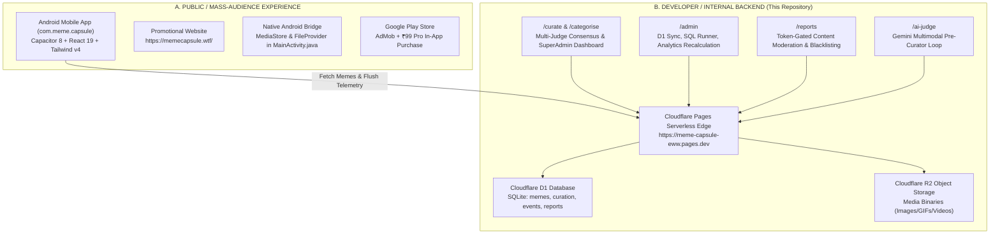

# MEME CAPSULE — MASTER KNOWLEDGE DOCUMENT & ARCHITECTURAL REFERENCE
### The Definitive System Specification for Developers, AI Coding Agents, Curators & Product Teams

> **Document Type:** Canonical Master Architecture & Product Specification  
> **Classification:** Living Project Context & Reusable AI Operating Reference  
> **App / System Name:** Meme Capsule  
> **Android Package Identifier:** `com.meme.capsule`  
> **Public Web Presence:** [https://memecapsule.wtf/](https://memecapsule.wtf/)  
> **Serverless Edge Backend:** [https://meme-capsule-eww.pages.dev](https://meme-capsule-eww.pages.dev)  
> **Current Version:** `1.0.0` (Production Android APK / Cloudflare Edge D1 & R2)  

---

## TABLE OF CONTENTS

1. [Meme Capsule — Core Product Questions (Stand-Alone FAQ)](#1-meme-capsule--core-product-questions-stand-alone-faq)
2. [Executive System Summary: Two Distinct Codebases](#2-executive-system-summary-two-distinct-codebases)
3. [PART A: PUBLIC / MASS-AUDIENCE EXPERIENCE](#3-part-a-public--mass-audience-experience)
   - 3.1 [Product Identity, Philosophy & Vision](#31-product-identity-philosophy--vision)
   - 3.2 [Target Users, Personas & Core Scenarios](#32-target-users-personas--core-scenarios)
   - 3.3 [Complete End-User Feature Inventory](#33-complete-end-user-feature-inventory)
   - 3.4 [User Experience & Application Workflows](#34-user-experience--application-workflows)
   - 3.5 [Mobile Client Architecture & Native Android Bridge](#35-mobile-client-architecture--native-android-bridge)
   - 3.6 [Public Landing & Promotional Site (`memecapsule.wtf`)](#36-public-landing--promotional-site-memecapsulewtf)
   - 3.7 [Monetization, Purchases & Ad Strategy](#37-monetization-purchases--ad-strategy)
   - 3.8 [Content Strategy & Copy Kit](#38-content-strategy--copy-kit)
4. [PART B: DEVELOPER / INTERNAL BACKEND EXPERIENCE](#4-part-b-developer--internal-backend-experience)
   - 4.1 [Serverless Edge Infrastructure (Cloudflare Pages Functions)](#41-serverless-edge-infrastructure-cloudflare-pages-functions)
   - 4.2 [Database Architecture & D1 SQLite Schemas](#42-database-architecture--d1-sqlite-schemas)
   - 4.3 [Object Storage & Media Delivery (Cloudflare R2)](#43-object-storage--media-delivery-cloudflare-r2)
   - 4.4 [Internal Workbenches & Tooling Routes](#44-internal-workbenches--tooling-routes)
   - 4.5 [Curation & Categorization Engine (`/curate`, `/categorise`)](#45-curation--categorization-engine-curate-categorise)
   - 4.6 [SuperAdmin Conflict Resolution & Multi-Judge Consensus](#46-superadmin-conflict-resolution--multi-judge-consensus)
   - 4.7 [AI Pre-Judge Assisted Loop (`/ai-judge`)](#47-ai-pre-judge-assisted-loop-ai-judge)
   - 4.8 [Admin Data Management & SQL Runner (`/admin`)](#48-admin-data-management--sql-runner-admin)
   - 4.9 [Content Safety, User Reporting & Moderation (`/reports`)](#49-content-safety-user-reporting--moderation-reports)
   - 4.10 [Telemetry Pipeline & Analytics Recalculation Engine](#410-telemetry-pipeline--analytics-recalculation-engine)
5. [Neo-Brutalist Design System & Aesthetics](#5-neo-brutalist-design-system--aesthetics)
6. [Implementation Status Audit Matrix](#6-implementation-status-audit-matrix)
7. [Discrepancy Reconciliation & Known Uncertainties](#7-discrepancy-reconciliation--known-uncertainties)
8. [Project Terminology & Master Glossary](#8-project-terminology--master-glossary)
9. [AI Agent Portable Handoff Prompt](#9-ai-agent-portable-handoff-prompt)

---

## 1. MEME CAPSULE — CORE PRODUCT QUESTIONS (STAND-ALONE FAQ)

> [!TIP]
> This section is self-contained and formatted for instant extraction. It can be copied directly into prompts for other AI models, marketing assistants, or new developers to provide the canonical answers regarding Meme Capsule.

```
================================================================================
          MEME CAPSULE — CORE PRODUCT QUESTIONS & AUTHORITATIVE ANSWERS
================================================================================
```

### Q1: What is Meme Capsule?
**Meme Capsule** is an anti-algorithm, single-action meme delivery platform engineered for immediate entertainment without feeds, doomscrolling, or social clutter.
- **Public Product**: A native mobile application for Android (`com.meme.capsule`) and companion web presence (`https://memecapsule.wtf/`). Operating like a digital arcade vending machine, pressing the **`HIT ME`** button dispenses exactly one hand-screened, high-variance meme onto the screen.
- **Developer / Internal Backend**: A serverless edge architecture on Cloudflare Pages (`https://meme-capsule-eww.pages.dev`), Cloudflare D1 (SQLite database), and Cloudflare R2 (media bucket), coupled with Neo-Brutalist internal tools for human multi-judge curation (`/curate`), admin database syncing (`/admin`), user safety moderation (`/reports`), and AI-assisted pre-evaluation (`/ai-judge`).

### Q2: Why does it exist?
Meme Capsule was created as an explicit antidote to three modern internet problems:
1. **Algorithmic Feed Fatigue:** Conventional platforms (Instagram, TikTok, Reddit, X) trap users in repetitive recommendation loops optimized for watch time rather than humor.
2. **Doomscrolling Addiction:** Infinite scrolling lists turn a quick 30-second break into a 45-minute trance. Meme Capsule treats humor as discrete, high-impact "drops".
3. **Saving & Sharing Friction:** Cleanly saving a meme on Android usually requires taking a screenshot, cropping black bars, or dealing with intrusive app watermarks. Meme Capsule features native Android MediaStore integration for instant, lossless 1-tap gallery saving.

### Q3: Who is it for?
- **Digital Natives & Group Chat Regulars (Gen Z & Millennials):** Users who actively look for top-tier meme ammunition to share in WhatsApp, Telegram, or Discord group chats.
- **Micro-Break Seekers:** Students, commuters, and professionals who want a quick, punchy 30-second dopamine reset between classes or meetings.
- **Meme Curators & Hoarders:** Users who organize personal collections into categorized, color-coded **Mood Boards** ("Pinned Energy") for situational deployment.
- **Internal Editorial Teams:** Human curators and superadmins who evaluate and tag internet humor into structured taxonomy.

### Q4: How does it work?
- **Public End-User Flow:**
  1. The user launches the app and is greeted by a Cyber-Brutalist arcade interface featuring the massive **`HIT ME`** button.
  2. Tapping `HIT ME` triggers a retro hacker decryption loader while popping the next meme instantly from a 7-meme background FIFO prefetch buffer.
  3. The user reacts via rapid double-tap (triggering visual screen shake and floating stickers: `DANK!`, `CRINGE!`, `SO REAL`) or taps one of 6 persistent emoji reactions (`💀`, `🔥`, `😂`, `🗿`, `❤️`, `👑`).
  4. The user can save to their offline **Meme Vault**, pin to themed **Mood Boards**, download losslessly to `Pictures/Meme Capsule` via native Android MediaStore, or share via the native Android share sheet.
  5. Navigating further is done via vertical gestures: **Swipe Up** drops the next meme, **Swipe Down** navigates back to session history.
- **Internal Backend Flow:**
  1. Incoming memes are ingested into Cloudflare D1 (`memes` table) and R2 storage in an unfinalized `ARCHIVED` state (`is_active = 0`).
  2. Human judges (`Judge One` through `Judge Five`) log into `/curate` and categorize memes using rapid keyboard shortcuts (`K` Keep, `E` Exclude, `D` Duplicate, `L` Review Later).
  3. If judge decisions diverge, the SuperAdmin dashboard arbitrates consensus into `meme_curation_final`.
  4. ONLY memes authoritatively resolved as `keep` by Superadmin become `ACTIVE` (`is_active = 1`) and can be served through `/api/random-meme` to the mobile client; all unfinalized memes remain `ARCHIVED` and are strictly excluded from public delivery.
  5. Inappropriate content reported by users lands in `/reports` for one-click archiving and blacklisting.

### Q5: What are all of its features?
*(Classified by system and implementation status)*

| Feature Category | Specific Feature | Status | Environment |
|---|---|---|---|
| **Discovery** | Single-Tap Capsule Drop (`HIT ME`) | `[IMPLEMENTED]` | Public Android App |
| **Discovery** | 7-Meme FIFO Background Prefetch Buffer | `[IMPLEMENTED]` | Public Android App |
| **Discovery** | Vertical Gesture Swiping (Swipe Up / Down) | `[IMPLEMENTED]` | Public Android App |
| **Discovery** | Arcade Hacker Decryption Animation | `[IMPLEMENTED]` | Public Android App |
| **Discovery** | Alternating Strategy (2 D1 Custom + 1 Reddit Drop) | `[IMPLEMENTED]` | Public Android App |
| **Organization** | Offline Meme Vault (Searchable favorites) | `[IMPLEMENTED]` | Public Android App |
| **Organization** | Custom Mood Boards ("Pinned Energy" themed binders) | `[IMPLEMENTED]` | Public Android App |
| **Interactivity** | Double-Tap Animated Card Shake & Sticker Reactions | `[IMPLEMENTED]` | Public Android App |
| **Interactivity** | 6 Persistent Emoji Reactions (`💀`, `🔥`, etc.) | `[IMPLEMENTED]` | Public Android App |
| **Interactivity** | Streak Tracker & Gamified Rank Badges | `[IMPLEMENTED]` | Public Android App |
| **Native Android** | Scoped MediaStore Image Saving (`Pictures/Meme Capsule`) | `[IMPLEMENTED]` | Public Android App |
| **Native Android** | FileProvider System Share Sheet Bridge | `[IMPLEMENTED]` | Public Android App |
| **Monetization** | AdMob Interstitials (Every 4th drop) & Rewarded Drops | `[IMPLEMENTED]` | Public Android App |
| **Monetization** | In-App Purchase Pro Tier (₹99 "Remove Ads Forever") | `[IMPLEMENTED]` | Public Android App |
| **Safety** | Client Content Reporting & Local Auto-Blacklist | `[IMPLEMENTED]` | Public Android App |
| **Telemetry** | Circular Buffer Telemetry Queue (`/api/events`) | `[IMPLEMENTED]` | App & Backend |
| **Web Presence** | Neo-Brutalist Promotional Site (`memecapsule.wtf`) | `[IMPLEMENTED]` | Public Web |
| **Curation** | Multi-Judge Consensus Engine (`/curate`) | `[IMPLEMENTED]` | Internal Backend |
| **Curation** | Editorial Keyboard Navigation (Layer 0 Shortcuts) | `[IMPLEMENTED]` | Internal Backend |
| **Curation** | Multi-Topic, Tone & Mechanism Taxonomy Tagging | `[IMPLEMENTED]` | Internal Backend |
| **Curation** | SuperAdmin Conflict Resolution Dashboard | `[IMPLEMENTED]` | Internal Backend |
| **AI Operations** | AI Pre-Judge Assisted Loop (`/ai-judge`) | `[IMPLEMENTED]` | Internal Backend |
| **Administration** | D1 Metadata Management & R2 Storage Sync (`/admin`) | `[IMPLEMENTED]` | Internal Backend |
| **Administration** | Raw SQL Query Runner with Safety Controls | `[IMPLEMENTED]` | Internal Backend |
| **Moderation** | Content Moderation Dashboard (`/reports`) | `[IMPLEMENTED]` | Internal Backend |
| **Moderation** | One-Click Archive & `content_blacklist` Enforcement | `[IMPLEMENTED]` | Internal Backend |
| **Analytics** | D1 Engagement & Virality Recalculation Engine | `[IMPLEMENTED]` | Internal Backend |
| **Reliability** | Zero-Failure Static Fallback Pool (`fallbackMemes.ts`)| `[IMPLEMENTED]` | App & Backend |
| **Roadmap** | User-Submitted Meme Uploads to R2 | `[PLANNED]` | Public Android App |
| **Roadmap** | Cloud Account Sync & Web Mood Boards | `[PLANNED]` | Public Android App |
| **Roadmap** | Web Audio API Sound Effects (Arcade SFX) | `[PLANNED]` | Public Android App |

### Q6: How is it technically built?
- **Public Mobile App (`com.meme.capsule`):**
  - Framework: React 19, TypeScript 5.8, Vite 6.2, Tailwind CSS v4 (`@tailwindcss/vite`).
  - Mobile Container: Capacitor 8 (`@capacitor/core`, `@capacitor/android`, `@capacitor-community/admob`, `@capgo/native-purchases`).
  - Native Android Bridge: Custom `MainActivity.java` extending `BridgeActivity`, exposing `window.MemeCapsuleAndroid` via `addJavascriptInterface` to execute native Scoped Storage file streaming (`MediaStore.Images.Media`) and FileProvider URI share intents.
- **Serverless Edge Backend (This Repository):**
  - Edge Runtime: Cloudflare Pages serverless functions (`functions/api/*`, `functions/reports.ts`).
  - Relational Database: Cloudflare D1 (Serverless SQLite) with 6 migration scripts.
  - Media Storage: Cloudflare R2 object storage bucket (`env.BUCKET`) with public domain asset delivery.
  - Internal UI: React 19, TypeScript, Vite, Neo-Brutalist CSS (`curate.css`, `admin.css`, `cat.css`, `aiJudge.css`).
  - Upstream Relay: Secondary integration with public Reddit meme gateway (`meme-api.com/gimme`).

### Q7: How do users interact with it?
Interaction is physical, tactile, and zero-friction:
- **Tapping:** Massive arcade buttons that depress physically and shed their drop shadow when clicked.
- **Swiping:** Natural mobile vertical swipe gestures (Swipe Up for the next meme drop; Swipe Down for session history).
- **Double-Tapping:** Rapid double-tap on the meme card shakes the container (`animate-shake`) and pops playful animated reaction tags.
- **Long-Pressing:** Holding down on the meme card for 600ms initiates an immediate gallery download.
- **Zero Mandatory Login:** Ordinary users never encounter account forms, passwords, or emails.

### Q8: How does its backend work?
The backend runs 100% serverlessly across Cloudflare's global edge network:
1. **Delivery Pipeline:** When `/api/random-meme` is invoked, Cloudflare Pages queries D1 with a strict database-level inner join on `meme_curation_final`:
   ```sql
   SELECT m.* FROM memes m
   INNER JOIN meme_curation_final f ON m.id = f.meme_id
   WHERE m.is_active = 1 AND m.status = 'active' AND f.corpus_status = 'keep' AND m.random_key >= ?
   ORDER BY m.random_key ASC LIMIT 1
   ```
   Any meme that is unfinalized, still in judging, in arbitration, or archived is mathematically impossible to retrieve via `/api/random-meme` or `/api/daily-meme`.
2. **Telemetry Ingestion:** Client actions (view duration, skip, like, share, download) are enqueued into a client-side circular buffer and flushed periodically to `POST /api/events`.
3. **Analytics Engine:** The background recalculation script (`/api/admin/analytics/recalculate`) aggregates raw events into normalized ranking tables (`meme_analytics`), computing percentile rankings for virality, retention, and engagement.
4. **Moderation Pipeline:** User-reported memes trigger `POST /api/report`, populating `meme_reports`. Admins inspect flagged items via `/reports` to dismiss or blacklist them.

### Q9: How does its AI system work?
- **Public Product:** **ZERO AI RECOMMENDATION ALGORITHMS.** Meme Capsule deliberately rejects algorithmic feeds. Content delivery is randomized serendipity.
- **Internal Backend Pipeline (`/ai-judge`):** Operates an AI Pre-Judge loop powered by Google Gemini Vision (`gemini-1.5-flash` / `@google/genai`). It ingests unreviewed memes, reads image text via multimodal OCR, analyzes humor mechanisms and sarcasm, assesses cultural safety, and outputs structured JSON decisions (`corpus_status`, `topics`, `tone`, `humour_mechanisms`, `confidence`). Human curators can inspect, accept, or override these decisions with one click.

### Q10: What are its most important concepts and workflows?
1. **Capsule Drop:** The fundamental unit of consumption — exactly one isolated meme displayed with no distractions.
2. **FIFO Prefetch Pipeline:** A client queue buffering up to 7 validated images in memory so swiping feels instant and offline-tolerant.
3. **Meme Vault vs. Mood Boards:** The Vault is the complete offline flat archive of favorited memes; Mood Boards are user-created, color-coded themed collections ("Pinned Energy").
4. **Layer 0 Editorial Curation:** High-speed keyboard curation (`K`, `E`, `D`, `L`) allowing human curators to review hundreds of memes per hour.
5. **SuperAdmin Conflict Arbitration:** Multi-judge consensus architecture where diverging curator votes are surfaced for authoritative resolution into `meme_curation_final`.
6. **Archive vs. Blacklist:** Discontinued/excluded memes are set to `archived` (hidden from public drops, kept in storage); toxic/reported content is banned across the platform via `content_blacklist`.

### Q11: What is implemented vs planned?
- **Fully Implemented:** React 19 UI, Neo-Brutalist design language, Capacitor 8 Android container, Native MediaStore Java bridge, FileProvider native sharing, AdMob interstitials & rewarded ads, Google Play In-App Purchases, Mood Boards, Meme Vault, Content Reporting, Telemetry batching, Cloudflare D1/R2 backend, Multi-judge curation, SuperAdmin conflict resolution, AI Pre-Judge loop, `/reports` moderation dashboard, Static fallback system.
- **Planned / Future:** Community meme uploads via R2 presigned URLs, cross-device cloud vault synchronization, shareable public mood boards (`memecapsule.wtf/b/:id`), and Web Audio API arcade sound effects.

### Q12: What makes the application different?
1. **Anti-Algorithm Stance:** Pure serendipity and human curation instead of engagement-maximizing algorithms.
2. **Cyber-Brutalist Arcade Visuals:** Aggressive, punchy aesthetic featuring uppercase Anton typography, neon purple/yellow/pink accents, 3-4px thick borders, and hard offset shadows.
3. **Lossless Native Integration:** Custom Java bridge to Android `MediaStore` saving memes directly into `Pictures/Meme Capsule` without browser download prompts or watermarks.
4. **Extreme Respect for Attention:** No infinite feed, no tracking accounts, no notifications demanding return.

### Q13: What terminology should someone know before working on it?
- **Capsule Drop:** The single-meme display event.
- **HIT ME:** The primary arcade action button.
- **Meme Vault:** Local SQLite/localStorage database of user favorites.
- **Mood Board:** A user-curated themed binder of memes.
- **Layer 0 Curation:** Rapid first-pass human editorial classification.
- **Corpus Status:** Classification state of a meme (`keep`, `excluded`, `duplicate`, `review_later`).
- **SuperAdmin:** Authoritative curator resolving inter-judge voting conflicts.
- **MediaStore Bridge:** Custom Java interface `window.MemeCapsuleAndroid` in `MainActivity.java`.
- **Exclude-to-Archive:** Soft-removal workflow hiding memes from public rotation while preserving R2 assets.
- **Content Blacklist:** Permanent platform ban table (`content_blacklist`) for reported or abusive media.

---

## 2. EXECUTIVE SYSTEM SUMMARY: TWO DISTINCT CODEBASES

To prevent confusion between public user features and developer tooling, the Meme Capsule engineering ecosystem is partitioned into two distinct codebases:



1. **The Public Companion Repository (`com.meme.capsule`):**
   - Maintained with the mobile engineering team.
   - Contains the Capacitor 8 Android application, the Tailwind v4 client UI, native Android Java plugins, AdMob integrations, and Google Play billing.
   - Focus: Performance, tactile haptics, gesture animations, offline vault management, and user delight.
2. **The Serverless Edge & Internal Tools Repository (This Workspace):**
   - Deployed on Cloudflare Pages (`https://meme-capsule-eww.pages.dev`).
   - Houses the serverless edge API (`functions/api/*`), Cloudflare D1 database migrations, R2 storage connections, and internal Neo-Brutalist management workbenches.
   - The discontinued legacy landing UI (`App.tsx`, `styles.css`) has been officially removed; default traffic routes directly to the curation tool.
   - Focus: Scalability, low latency, database integrity, editorial consensus, content safety, and telemetry aggregation.

---

## 3. PART A: PUBLIC / MASS-AUDIENCE EXPERIENCE

### 3.1 Product Identity, Philosophy & Vision
Meme Capsule rejects the prevailing social media paradigm of engagement maximization. Modern platforms use infinite scrolling feeds to optimize ad inventory and session duration, trapping users in content bubbles. 

Meme Capsule positions itself as an **Arcade Vending Machine for Internet Culture**:
- **One Interaction:** Tapping `HIT ME` dispenses one curated meme.
- **Finite Gratification:** Enjoy a discrete laugh, react, share, and exit.
- **Anti-Algorithm:** Random serendipity replaces recommendation algorithms.
- **Privacy by Default:** Zero tracking, zero profiles, zero mandatory accounts.

### 3.2 Target Users, Personas & Core Scenarios
1. **The Group Chat Sharer (20-28 yrs):** Lives in WhatsApp/Telegram group chats. Needs fast, high-quality meme ammunition without watermarks. Uses native gallery download and instant sharing.
2. **The Micro-Break Seeker (18-35 yrs):** Needs a 30-second break between cognitive tasks. Opens Meme Capsule, takes 3 drops, gets a dopamine boost, and locks the phone.
3. **The Meme Hoarder:** Organizes humor into thematic Mood Boards ("Tech Pain", "Unhinged Cat Memes", "Workplace Trauma") for immediate conversational retrieval.

### 3.3 Complete End-User Feature Inventory
- **Single-Tap Capsule Drop:** Main interactive mechanic delivering curated memes with arcade animations.
- **FIFO 7-Meme Prefetch Buffer:** Client background worker preloads up to 7 images into memory, ensuring zero-latency navigation when swiping.
- **Vertical Touch Gestures:**
  - *Swipe Up:* Trigger the next drop immediately.
  - *Swipe Down:* Open session history to review previously seen memes.
- **Arcade Hacker Decryption Animation:** Simulated decryption logs (`DECRYPTING_PACKET`, `VERIFYING_HASH`) disguising initial network latency as game mechanics.
- **Meme Vault:** Persistent offline favorites list with instant full-text search.
- **Mood Boards ("Pinned Energy"):** Categorized binders allowing users to group memes with custom titles and color themes.
- **Double-Tap Shake & Reaction Overlays:** Double-tapping shakes the meme card and displays animated stickers (`DANK!`, `CRINGE!`, `SO REAL`).
- **Emoji Reaction Bar:** 6 persistent reaction counts (`💀`, `🔥`, `😂`, `🗿`, `❤️`, `👑`).
- **Native Android MediaStore Download:** Custom Java bridge streaming images directly into Android's `Pictures/Meme Capsule` gallery folder with zero permission prompts (Android 10+ scoped storage compliant).
- **Native FileProvider Sharing:** Bypasses web share limitations by caching images locally and launching the native Android intent chooser.
- **Streak & Rank Gamification:** Tracks consecutive active days, awarding titles from `FRESH` to `MEME GOD`.
- **Monetization & Pro Upgrade:**
  - *AdMob:* Non-intrusive interstitials every 4th drop and optional rewarded ads for bonus drops.
  - *In-App Purchase (₹99 One-Time):* Permanently unlocks zero ads, unlimited vault storage, priority drops, and permanent Triple Drop access.
- **Content Safety & Local Blacklisting:** Users can flag inappropriate content via a modal. The app immediately blacklists the meme locally and transmits a report to `/api/report`.

### 3.4 Mobile Client Architecture & Native Android Bridge
The public app packages a modern web frontend inside a native Android container using **Capacitor 8**.

#### Native Android Java Bridge (`MainActivity.java`):
Web standard `fetch()` and `blob:` downloads frequently fail inside Android WebViews due to scoped storage security restrictions. Meme Capsule injects a custom Java bridge `window.MemeCapsuleAndroid`:
```java
public class MainActivity extends BridgeActivity {
    @Override
    public void onCreate(Bundle savedInstanceState) {
        super.onCreate(savedInstanceState);
        bridge.getWebView().addJavascriptInterface(new MemeCapsuleAndroidBridge(this), "MemeCapsuleAndroid");
    }
}
```
- **`downloadImage(url, filename)`**: Uses `HttpURLConnection` to stream media in the background, writing directly into `MediaStore.Images.Media.EXTERNAL_CONTENT_URI` under `Pictures/Meme Capsule`.
- **`shareImage(url, filename, caption)`**: Caches media in the application's cache directory and exposes it via Android `FileProvider` (`androidx.core.content.FileProvider`), launching the system `ACTION_SEND` intent chooser.

### 3.5 Public Landing & Promotional Site (`memecapsule.wtf`)
The official public landing site hosts:
- **App Identity & Download Showcase:** Interactive 3D phone frames, live capsule preview, and direct Google Play download CTA.
- **Contact & Feedback Form:** Direct HTTP POST integration powered by **Formspree** (`https://formspree.io/f/xwlenwzr`), collecting Name, Email, Subject, and Message forwarded directly to the developer mailbox (`bbethical010@gmail.com`).
- **Web Analytics & Telemetry:** Standard Google Analytics 4 (`G-8VMD4ZNQQK`) loaded via Google Tag Manager (`gtag.js`), collecting anonymous site traffic metrics and setting first-party cookies (`_ga`, `_ga_8VMD4ZNQQK`).
- **Zero Marketing Pixels or Newsletters:** No social tracking pixels (Meta, TikTok, Twitter) and no mailing lists (Mailchimp, ConvertKit) exist on the site.
- **Privacy & Compliance Reference:** For complete regulatory mappings, cookie expirations, AdMob disclosures, and Google Play Data Safety guides, see [`docs/PRIVACY_COOKIES_AND_DATA_FLOWS.md`](./PRIVACY_COOKIES_AND_DATA_FLOWS.md).

### 3.6 Content Strategy & Copy Kit
- **One-Sentence Pitch:** *Meme Capsule is a high-octane Android meme discovery app that delivers curated internet humor one tap at a time with zero algorithms and zero doomscrolling.*
- **Play Store Short Description:** *Tired of recycled algorithm feeds? Tap HIT ME to get hand-picked unhinged memes dropped straight to your screen. Save to your Vault, organize Mood Boards, and share instantly with zero watermarks.*
- **Core Product Slogans:**
  - *"One tap. One meme. Zero algorithms."*
  - *"Stop scrolling. Start dropping."*
  - *"Internet humor, curated by humans, delivered like an arcade game."*

---

## 4. PART B: DEVELOPER / INTERNAL BACKEND EXPERIENCE

### 4.1 Serverless Edge Infrastructure (Cloudflare Pages Functions)
The backend is completely serverless, deployed on Cloudflare Pages. Functions located in `functions/` execute across Cloudflare's global edge network:
- **`GET /api/random-meme`**: Fetches a random approved meme record from D1.
- **`GET /api/daily-meme`**: Deterministically selects the curated daily meme based on the current UTC date.
- **`POST /api/events`**: Ingests batched telemetry events into the D1 event queue.
- **`POST /api/report`**: Receives user safety reports and logs them in `meme_reports`.
- **`/reports`**: Serves the standalone HTML/CSS moderation dashboard for reviewing flagged content.
- **`/api/cat/*` & `/api/curate/*`**: Authenticated endpoints serving the multi-judge curation system.
- **`/api/admin/*`**: Token-protected administrative endpoints for storage syncing, SQL execution, and analytics management.

### 4.2 Database Architecture & D1 SQLite Schemas
Meme Capsule uses Cloudflare D1 (serverless SQLite). The database schema has evolved through 6 production migration files (`d1/migrations/`):

1. **`memes` (Core Media Catalog):**
   - `id` (TEXT PRIMARY KEY): Unique identifier.
   - `url` (TEXT): Public URL in Cloudflare R2.
   - `category` (TEXT): Primary humor category.
   - `tags` (TEXT): JSON array of string tags.
   - `rarity` (TEXT): Drop rarity (`Common`, `Rare`, `Legendary`).
   - `status` (TEXT): Lifecycle state (`active`, `archived`, `draft`).
   - `is_active` (INTEGER): Delivery flag (1 = active, 0 = inactive).
   - `curation_status` (TEXT DEFAULT NULL): Explicit editorial status (`keep`, `excluded`, `duplicate`, `review_later`, or `NULL` for uncurated backlog). Added in Migration 012 to partition the corpus cleanly into Active Capsule (111), Superadmin Excluded (53), and Uncurated Backlog (4,947).
   - `created_at`, `updated_at` (DATETIME).

2. **`meme_curation` (Judge Consensus Votes):**
   - `id` (INTEGER PRIMARY KEY AUTOINCREMENT).
   - `meme_id` (TEXT): References `memes.id`.
   - `curator_id` (TEXT): References `cat_users.username`.
   - `corpus_status` (TEXT): Vote state (`keep`, `excluded`, `duplicate`, `review_later`).
   - `topics` (TEXT): JSON array of selected topics.
   - `tone` (TEXT): Selected humor tone.
   - `humour_mechanisms` (TEXT): JSON array of up to 2 mechanisms.
   - `duplicate_of` (TEXT): ID of original meme if marked duplicate.
   - `curator_note` (TEXT): Editorial comments.
   - `created_at` (DATETIME).

3. **`meme_curation_final` (SuperAdmin Authoritative Resolutions):**
   - Resolves voting conflicts between multiple judges into a single authoritative record.

4. **`cat_users` (Curator Accounts):**
   - `username` (TEXT PRIMARY KEY), `password_hash` (SHA-256), `role` (`judge` or `superadmin`), `is_active` (INTEGER).

5. **`meme_reports` (Content Moderation Queue):**
   - `id` (INTEGER PRIMARY KEY AUTOINCREMENT), `meme_id` (TEXT), `reason` (TEXT), `details` (TEXT), `status` (`pending`, `resolved`, `dismissed`), `created_at` (DATETIME).

6. **`content_blacklist` (Global Ban Registry):**
   - `meme_id` (TEXT PRIMARY KEY), `reason` (TEXT), `created_at` (DATETIME).

7. **`meme_events` & `meme_analytics` (Telemetry & Rankings):**
   - Raw event stream and aggregated engagement/virality metrics.

### 4.3 Object Storage & Media Delivery (Cloudflare R2)
Media assets (images, GIFs, MP4 videos) are stored in an S3-compatible Cloudflare R2 bucket (`env.BUCKET`). Assets are addressed publicly via custom domain resolution (`env.R2_PUBLIC_URL`) with global edge caching.

### 4.4 Internal Workbenches & Tooling Routes
All internal tools use the high-contrast Neo-Brutalist design system:
- **`/curate`**: Primary curation portal with multi-judge consensus and SuperAdmin command center.
- **`/admin`**: Administrative control panel for D1/R2 synchronization, SQL runner, and analytics recalculation.
- **`/reports`**: Token-gated moderation dashboard for reviewing user-flagged memes.
- **`/ai-judge`**: Autonomous/assisted evaluation loop using Gemini Vision.
- **`/categorise`**: Legacy judge categorization portal.

### 4.5 Curation & Categorization Engine (`/curate`, `/categorise`)
Designed for rapid, high-volume human evaluation. Curators can review hundreds of memes per hour using Layer 0 keyboard shortcuts:
- `K`: **Keep** (Approved for public delivery).
- `E`: **Exclude** (Archived; hidden from public drops).
- `D`: **Duplicate** (Flag as duplicate with target ID).
- `L`: **Review Later** (Deferred to secondary review queue).
- `1-9, 0, -, =`: Toggle topic taxonomy.
- `Q, W, E, A, S, F`: Select humor tone.
- `Z, C, V, B, N, M, J, P, O`: Select humor mechanisms.
- `Cmd/Ctrl + Z`: Instant undo last curation decision.

### 4.6 SuperAdmin Conflict Resolution & Multi-Judge Consensus
When two or more judges evaluate the same meme with conflicting verdicts (e.g., Judge A votes `keep`, Judge B votes `excluded`), the meme surfaces in the **SuperAdmin Command Center**. Superadmins review judge notes, inspect topics, and cast the binding authoritative decision written into `meme_curation_final`:
- **Authoritative Keep (`corpus_status = 'keep'`)**: Automatically activates the meme in `memes` (`status = 'active'`, `is_active = 1`, `curation_status = 'keep'`), registering it in the live public spawn pool (111 memes).
- **Authoritative Excluded (`corpus_status = 'excluded'`)**: Sets the meme to `status = 'archived'`, `is_active = 0`, and `curation_status = 'excluded'`, permanently isolating it from public drops while preserving it for editorial audit (53 memes).
- **Status & Count Synchronization**: Superadmin Command Center and `/admin` read from this canonical database state:
  - Superadmin displays `AUTHORITATIVE RESOLVED (ACTIVE)` matching `/admin Active` (exactly 111 memes), alongside an explicit indicator of authoritatively excluded decisions (53 excluded memes, totaling 164 historical resolutions).
  - `/admin` provides a dedicated 5-way status metric bar and filter tabs:
    - **Total Memes:** 5,111
    - **Active:** 111 (spawn-eligible in public APK)
    - **Excluded:** 53 (superadmin-rejected; displayed with high-visibility red badge)
    - **Archived:** 4,947 (uncurated backlog awaiting judge/superadmin review)
    - **Drafts:** 0 (local browser drafts)
- **Public Spawn Gating**: The public delivery APIs (`/api/random-meme`, `/api/daily-meme`, `/api/memes/random`) strictly require an inner join on `meme_curation_final` with `corpus_status = 'keep'`, ensuring unfinalized or excluded memes can never enter user capsule drops.

### 4.7 AI Pre-Judge Assisted Loop (`/ai-judge`)
A serverless multimodal pipeline powered by Google Gemini Vision (`gemini-1.5-flash`):
1. Ingests unreviewed meme image URLs from D1.
2. Extracts on-image captions, identifies meme templates, and evaluates visual humor.
3. Classifies topics, tone, and humor mechanisms with confidence scoring (0.0 to 1.0).
4. Outputs structured recommendations. In automated mode, decisions exceeding 92% confidence can be auto-applied; lower-confidence decisions are staged for human approval.

### 4.8 Admin Data Management & SQL Runner (`/admin`)
Token-protected control center (`ADMIN_API_TOKEN`):
- **Storage Sync:** Scans R2 bucket, identifies unindexed media files, and inserts them into D1 as new meme candidates.
- **SQL Runner:** Allows administrators to execute raw SQLite queries directly against D1 with safety guards preventing accidental drops.
- **Analytics Management:** Triggers the recalculation engine and provides CSV/Excel export capabilities.

### 4.9 Content Safety, User Reporting & Moderation (`/reports`)
Standalone, token-protected dashboard rendering directly from `functions/reports.ts`:
- Lists all pending user reports from the mobile app.
- Previews the reported meme, reason (`NSFW`, `Hate Speech`, `Harassment`, `Copyright`), and reporter details.
- **Actions:**
  - *Dismiss:* Clears report as benign.
  - *Archive Meme:* Sets meme `status = 'archived'` in D1 (soft removal).
  - *Blacklist Meme:* Sets `status = 'archived'` AND permanently records the meme in `content_blacklist`.

### 4.10 Telemetry Pipeline & Analytics Recalculation Engine
- **Client Side:** Client actions (`view`, `skip`, `like`, `share`, `download`) are enqueued into a local circular buffer and flushed every 30 seconds to `POST /api/events`.
- **Edge Side:** Events are written into `meme_events` with timestamps and session identifiers.
- **Recalculation:** The recalculation worker aggregates events across time windows, computing:
  - *Engagement Score:* Weighted combination of likes, shares, and downloads against views.
  - *Virality Score:* Ratio of external shares to total views.
  - *Skip Rate:* Percentage of views lasting under 1.5 seconds.
  - *Percentile Rankings:* Normalized scoring used for internal editorial insight.

---

## 5. NEO-BRUTALIST DESIGN SYSTEM & AESTHETICS

All internal tools and the public mobile application share a unified **Neo-Brutalist / Cyber-Arcade** design language:

```text
┌────────────────────────────────────────────────────────────┐
│                    NEO-BRUTALIST TOKENS                    │
├───────────────────┬────────────────────────────────────────┤
│ Background        │ Dark Obsidian #121212 / #131313        │
│ Card Surfaces     │ Dark Panel #1a1a1a / #1c1b1b           │
│ Primary Accent    │ High-Voltage Purple #9b30ff            │
│ Secondary Accent  │ Arcade Gold #f4c300                    │
│ Tertiary Accent   │ Cyber Pink #dd0061                     │
│ Success Accent    │ Terminal Green #34c759                 │
│ Primary Font      │ Anton (Uppercase, Heavy Impact)        │
│ Body Font         │ Oswald / Chivo (High Legibility)       │
│ Borders           │ Solid 2px to 4px Black or Accent       │
│ Box Shadows       │ Hard Offset 4px to 6px (No blur)       │
└───────────────────┴────────────────────────────────────────┘
```

- **Hard Contrast:** Eliminates subtle gradients and soft blurs in favor of stark, aggressive contrast.
- **Tactile Feedback:** Buttons shed their hard offset box shadows on active press, simulating a physical arcade button depress.
- **Typography:** Heavy uppercase `Anton` headings convey bold authority, supported by condensed `Oswald` body copy.

---

## 6. IMPLEMENTATION STATUS AUDIT MATRIX

| System Component | Specific Module | Status | Verification Evidence |
|---|---|---|---|
| **Public Mobile Client** | Capacitor 8 Container & React 19 UI | `[IMPLEMENTED]` | Verified in companion repo (`app_info.md`) |
| **Public Mobile Client** | HIT ME Arcade Drop & Prefetch Buffer | `[IMPLEMENTED]` | Verified in companion repo (`app_info.md`) |
| **Public Mobile Client** | Scoped MediaStore Native Java Bridge | `[IMPLEMENTED]` | `MainActivity.java` in companion repo |
| **Public Mobile Client** | FileProvider Share Sheet Bridge | `[IMPLEMENTED]` | `MainActivity.java` in companion repo |
| **Public Mobile Client** | AdMob Interstitials & Rewarded Drops | `[IMPLEMENTED]` | `@capacitor-community/admob` in companion repo |
| **Public Mobile Client** | In-App Purchases (₹99 Pro Tier) | `[IMPLEMENTED]` | `@capgo/native-purchases` in companion repo |
| **Public Mobile Client** | User-Submitted Meme Uploads | `[PLANNED]` | Documented roadmap in `app_info.md` |
| **Public Mobile Client** | Cross-Device Cloud Vault Sync | `[PLANNED]` | Documented roadmap in `app_info.md` |
| **Public Web Landing** | Promotional Site (`memecapsule.wtf`) | `[IMPLEMENTED]` | Live domain & companion codebase |
| **Backend Storage** | Cloudflare R2 Media Bucket (`env.BUCKET`) | `[IMPLEMENTED]` | `wrangler.toml`, `functions/_shared/d1r2.ts` |
| **Backend Database** | Cloudflare D1 SQLite Database | `[IMPLEMENTED]` | 6 migration files in `d1/migrations/` |
| **Backend Edge API** | `/api/random-meme` & `/api/daily-meme` | `[IMPLEMENTED]` | `functions/api/random-meme.ts`, `daily-meme.ts` |
| **Backend Edge API** | `/api/events` Telemetry Ingestion | `[IMPLEMENTED]` | `functions/api/events.ts` |
| **Backend Edge API** | `/api/report` User Content Safety | `[IMPLEMENTED]` | `functions/api/report.ts` |
| **Internal Tools** | Multi-Judge Curation Portal (`/curate`) | `[IMPLEMENTED]` | `src/curate/CurateApp.tsx` |
| **Internal Tools** | SuperAdmin Consensus Dashboard | `[IMPLEMENTED]` | `src/curate/super/CurateSuperDashboard.tsx` |
| **Internal Tools** | Content Moderation Dashboard (`/reports`) | `[IMPLEMENTED]` | `functions/reports.ts` |
| **Internal Tools** | AI Pre-Judge Loop (`/ai-judge`) | `[IMPLEMENTED]` | `src/ai-judge/AiJudgeApp.tsx` |
| **Internal Tools** | Admin Control Panel & SQL Runner (`/admin`)| `[IMPLEMENTED]` | `src/admin/AdminApp.tsx` |
| **Internal Tools** | Analytics Recalculation Engine | `[IMPLEMENTED]` | `functions/api/admin/analytics/recalculate.ts` |
| **Discontinued UI** | Legacy Pastel Landing UI (`App.tsx`) | `[REMOVED]` | Removed from repo; default route now `/curate` |

---

## 7. DISCREPANCY RECONCILIATION & KNOWN UNCERTAINTIES

1. **Legacy Service Worker vs. Mobile Client:**
   - *Discrepancy:* Old web documentation described `sw.js` caching. The companion mobile documentation noted that an old service worker caused `Failed to fetch` errors in WebViews and was explicitly unregistered.
   - *Reconciliation:* Service worker registration is no longer active on the client. Offline capability is provided natively by Capacitor and local SQLite/localStorage caching.
2. **AI Recommendation Claims:**
   - *Discrepancy:* Generic templates mentioned AI recommendation feeds.
   - *Reconciliation:* Grounded code audit confirms that **zero AI recommendation algorithms exist in the public app**. Serendipitous randomization is the core product philosophy. Generative AI is strictly restricted to the internal curation pre-judge loop (`/ai-judge`).
3. **Discontinued Root UI (`App.tsx`):**
   - *Discrepancy:* Earlier repository revisions hosted a pastel web landing page at `/`.
   - *Reconciliation:* The old landing UI has been completely removed from this codebase. The public user interface is exclusively delivered via the companion mobile APK and `memecapsule.wtf`. The default route `/` on this backend instance serves the Neo-Brutalist curation workspace.

---

## 8. PROJECT TERMINOLOGY & MASTER GLOSSARY

- **Capsule Drop:** The atomic presentation of one isolated, curated meme.
- **HIT ME:** The primary arcade CTA button initiating a capsule drop.
- **Meme Vault:** The user's offline collection of favorited memes stored on their device.
- **Mood Board ("Pinned Energy"):** A user-created thematic binder (e.g., "Workplace Chaos") grouping selected memes.
- **Neo-Brutalism:** The aesthetic design system characterized by heavy 3-4px black borders, hard offset shadows, vibrant neon accents, and dark backgrounds.
- **FIFO Prefetch Buffer:** An in-memory queue maintaining up to 7 pre-validated memes to enable instantaneous swiping without network lag.
- **MediaStore Bridge:** The native Android Java interface `window.MemeCapsuleAndroid` injected via WebKit in `MainActivity.java` to write media directly into Android's public gallery.
- **Layer 0 Curation:** High-speed, keyboard-driven human screening (`K`, `E`, `D`, `L`) of raw meme corpora.
- **SuperAdmin Arbitration:** The process where a senior curator resolves diverging multi-judge votes into an authoritative consensus record.
- **Corpus Status:** The classification state of a meme (`keep`, `excluded`, `duplicate`, `review_later`).
- **Exclude-to-Archive:** Soft-deleting a meme from public rotation while preserving its file asset in Cloudflare R2.
- **Content Blacklist:** A permanent ban table (`content_blacklist`) used by moderators to suppress unsafe or copyright-infringing content.

---

## 9. AI AGENT PORTABLE HANDOFF PROMPT

> [!NOTE]
> Copy and paste this block into any prompt to give a new AI coding agent complete, unhallucinated operating context for Meme Capsule.

```text
=== PORTABLE CONTEXT: MEME CAPSULE ===
APP NAME: Meme Capsule
PACKAGE ID: com.meme.capsule
CORE CONCEPT: Anti-algorithm, single-action meme discovery platform with an Arcade / Cyber-Brutalist aesthetic. Tapping "HIT ME" drops one curated meme. No infinite feeds.

SYSTEM SEPARATION:
1. PUBLIC MOBILE APP (Companion Repository):
   - Tech: React 19, TypeScript, Vite, Tailwind CSS v4, Capacitor 8 Android container.
   - Native: MainActivity.java injects "window.MemeCapsuleAndroid" for Scoped MediaStore gallery saving (Pictures/Meme Capsule) and FileProvider intent sharing.
   - Features: HIT ME drop, 7-meme FIFO prefetch buffer, vertical gestures (swipe up/down), Meme Vault (favorites), Mood Boards, AdMob, In-App Purchase (₹99 Pro tier).
   - Domain: https://memecapsule.wtf/
2. SERVERLESS BACKEND & INTERNAL WORKBENCHES (This Repository):
   - Tech: Cloudflare Pages Functions, Cloudflare D1 (SQLite), Cloudflare R2 (Object Storage).
   - Internal Tools (Neo-Brutalist dark theme #121212, Anton/Oswald fonts):
     * /curate & /categorise: Multi-judge consensus curation with Layer 0 keyboard shortcuts (K, E, D, L) and SuperAdmin conflict arbitration.
     * /admin: D1/R2 sync, SQL runner, analytics recalculation.
     * /reports: Token-gated moderation dashboard for user-flagged memes (archive / blacklist).
     * /ai-judge: Gemini Multimodal Vision loop for pre-curation recommendations.
   - Discontinued: Old pastel root landing UI (App.tsx, styles.css) has been REMOVED. Default route / serves <CurateApp />.

CRITICAL RULES & CONSTRAINTS:
1. STRICT PROTECTION: Do NOT touch or redesign /curate, /admin, or /reports.
2. NO ALGORITHMS: The public delivery philosophy is anti-algorithmic serendipity. Never add recommendation algorithms.
3. NO HALLUCINATIONS: Maintain clear separation between public mobile features and internal developer tools.
======================================
```
